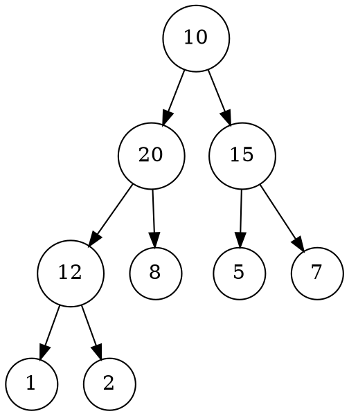
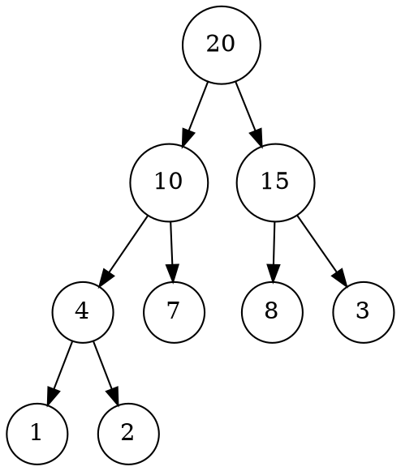
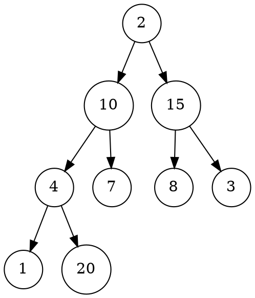
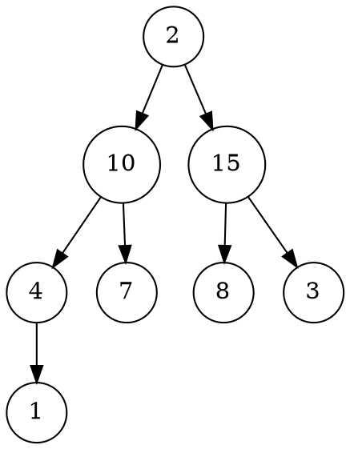
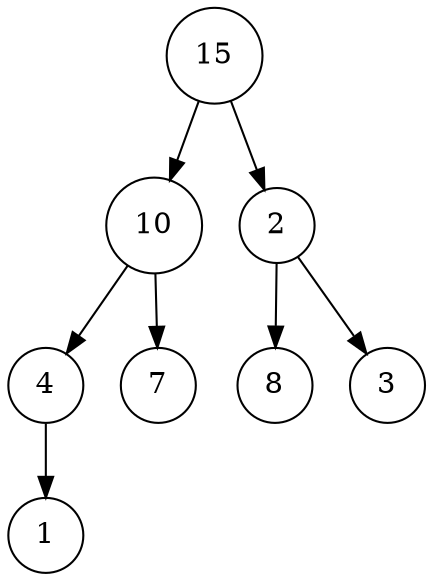
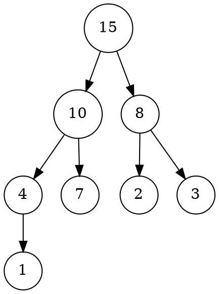
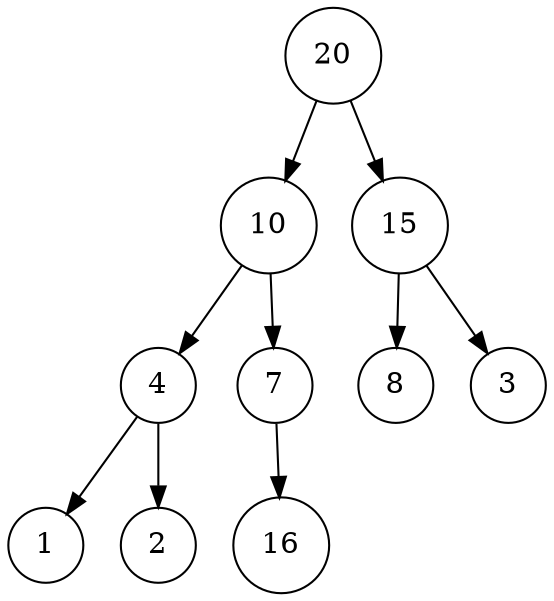
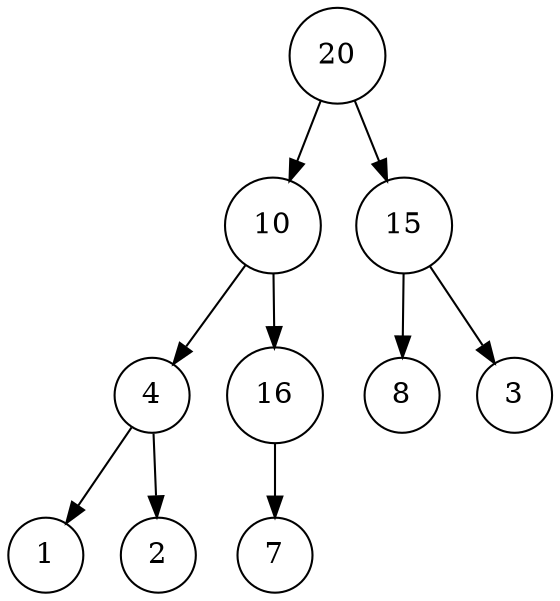
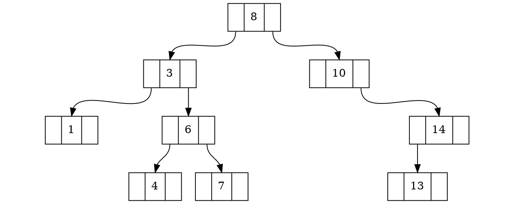

# LISTA 2 – Árvores 
## Prof. Igor Machado Coelho 

Obs.: Os algoritmos de resposta desta lista encontram-se no repositório [GitHub](https://github.com/ecostadelle/arvores). A visualização das árvores, produzidas em [GraphViz](https://www.graphviz.org/), não são renderizadas pelo interpretador de MarkDown do GitHub. Por essa razão, esta lista será entregue em PDF.

---

### Exercício 1:

Considere uma árvore binária completa composta pelos seguintes elementos (representação sequencial): 10,20,15,12,8,5,7, 1 e 2. 



a. Apresente o percurso de pré-ordem na árvore

> 10, 20, 12, 1, 2, 8, 15, 5, 7

b. Apresente o percurso em-ordem na árvore

> 1, 12, 2, 20, 8, 10, 5, 15, 7

c. Apresente o percurso de pós-ordem na árvore 
    
> 1, 2, 12, 8, 20, 5, 7, 15, 10

---

### Exercício 2:

Considere uma estrutura MAX-heap representada pelo seguinte vetor de níveis: 20, 10, 15, 4, 7, 8, 3, 1, 2 

a. efetue a remoção do elemento de maior prioridade: desenhe a árvore e vetor passo-a-passo 




> Condição inicial: 20, 10, 15, 4, 7, 8, 3, 1, 2



> Primeiro passo, comuta os valores do elemento de maior prioridade(20) com o último elemento do vetor(2): 2, 10, 15, 4, 7, 8, 3, 1, 20



> Segundo passo, remove o elemento de maior prioridade (20): 2, 10, 15, 4, 7, 8, 3, 1



> Terceiro passo, comuta o elemento que está fora de ordem (2) com o filho de maior prioridade (15): 15, 10, 2, 4, 7, 8, 3, 1



> Quarto passo, comuta novamente o elemento que está fora de ordem (2) com o filho de maior prioridade (8): 15, 10, 8, 4, 7, 2, 3, 1
---

   b. efetue a inserção do elemento 16 (sem considerar a remoção anterior): desenhe a árvore e vetor passo-a-passo 



> 20, 10, 15, 4, 7, 8, 3, 1, 2, 16



> 20, 10, 15, 4, 16, 8, 3, 1, 2, 7


> 20, 16, 15, 4, 10, 8, 3, 1, 2, 7

---

### Exercício 3:

Considere a seguinte estrutura para uma árvore binária: 

    ```cpp
    class Arvore
    {
    public:
        No *raiz;
    };

    class No
    {
    public:
        No *esq;
        No *dir;
    };
    ```

---

Para resolver essa questão, acrescentei às classes ``No`` e ``Arvore`` métodos construtores e destrutores. Ainda na classe ``No`` acrescentei uma variável para armazenar um dado do tipo inteiro (``int valor``). De modo que as classe no arquivo de cabeçalho ``arvore.hpp`` ficaram como demonstrado no bloco de código  abaixo:

```cpp
class No
{
public:
    No *esq;
    No *dir;
    int valor;
    No(int);
    ~No();
};

class Arvore
{
public:
    No *raiz;
    Arvore();
    ~Arvore();
};
```


Em seguida populei os dados com uma árvore de busca. Como as variáveis ``*esq`` e ``*dir`` estavam públicas, as operei diretamente. Os valores inseridos na árvore teste são os mostrados a seguir:




A inserção foi feita como mostrado no bloco de código, abaixo:

```cpp
// cria a árvore
Arvore arvore;

// insere os nós na árvore
arvore.raiz = new No(8);
arvore.raiz->esq = new No(3);
arvore.raiz->dir = new No(10);
arvore.raiz->esq->esq = new No(1);
arvore.raiz->esq->dir = new No(6);
arvore.raiz->dir->dir = new No(14);
arvore.raiz->esq->dir->esq = new No(4);
arvore.raiz->esq->dir->dir = new No(7);
arvore.raiz->dir->dir->esq = new No(13);
```

---

a. Escreva um algoritmo para computar a soma das folhas 

   O algoritmo percorre todos os nós da árvore em busca daqueles que não possuem filhos. Quando os encontra, retorna o seu valor (somado com $0$). As chamadas são recursivas e, como retorno, cada nó pai devolve a soma de seus filhos. Considerando que o algoritmo percorre toda a árvore, é possível concluir que depende diretamente do número de nós ($n$), nesse sentido o tempo de execução do algoritmo é $O(n)$.

```cpp
int somaFolhas(No *no)
{
    // variável para armazenar o valor da soma no escopo
    int soma = 0;
    // chamada recursiva para acessar os nós filhos localizados à esquerda
    if (no->esq) soma += somaFolhas(no->esq);
    // chamada recursiva para acessar os nós filhos localizados à direita
    if (no->dir) soma += somaFolhas(no->dir);
    // se o nó atual não possuir filhos, soma o valor do nó atual
    if (!no->esq and !no->dir) soma += no->valor;
    // retorna a soma
    return soma;
}
```

b. Escreva um algoritmo para efetuar um percurso de pós-ordem

c. Escreva um algoritmo para efetuar um percurso de em-ordem

d. Escreva um algoritmo para efetuar um percurso de pré-ordem

e. Escreva um algoritmo para computar a altura de um dado nó 

f. Escreva um algoritmo para computar o fator de balanceamento de um dado nó 

g. Escreva um algoritmo para percorrer a árvore em níveis

h. Escreva um algoritmo para computar o produto dos nós

