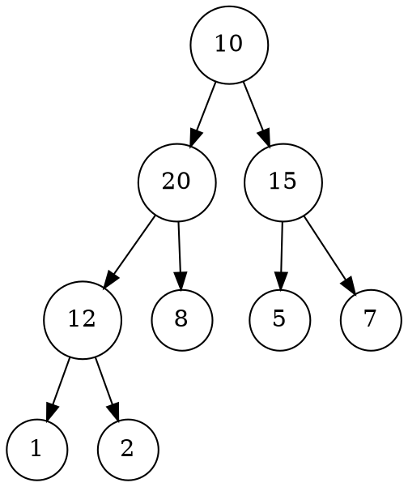
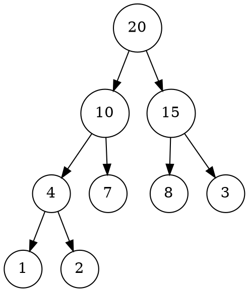
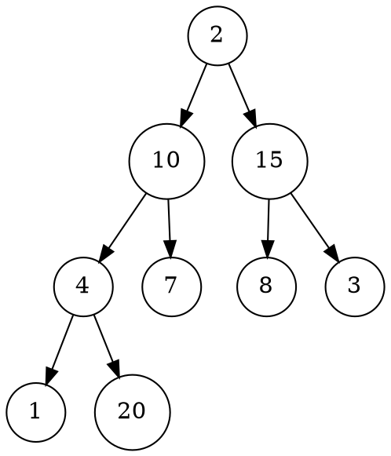
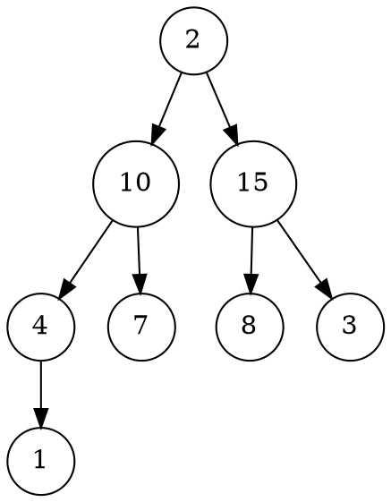
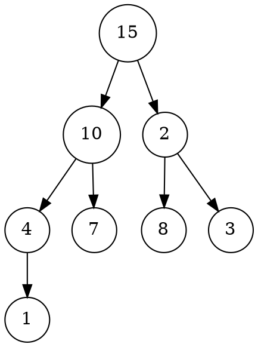
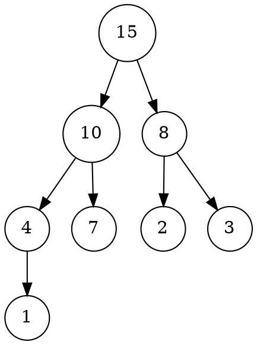
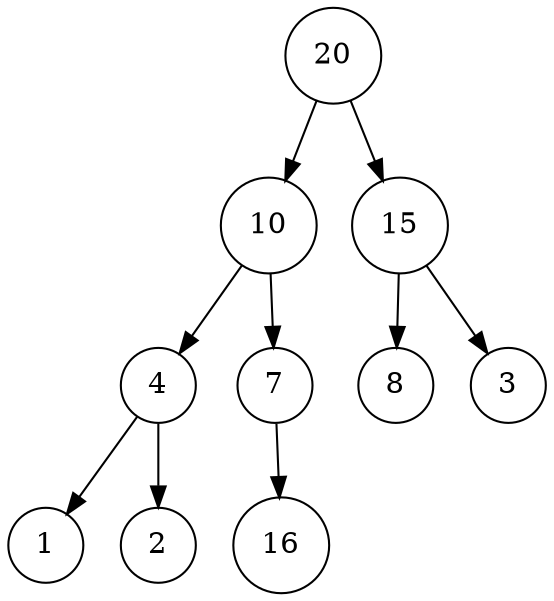
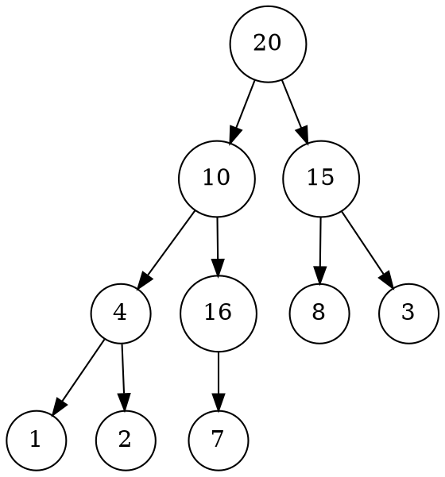

# LISTA 2 – Árvores 
## Prof. Igor Machado Coelho 

1. Considere uma árvore binária completa composta pelos seguintes elementos (representação sequencial): 10,20,15,12,8,5,7, 1 e 2. 

    a. Apresente o percurso de pré-ordem na árvore 

    > 10, 20, 12, 1, 2, 8, 15, 5, 7

    b. Apresente o percurso em-ordem na árvore

    > 1, 12, 2, 20, 8, 10, 5, 15, 7

    c. Apresente o percurso de pós-ordem na árvore 
    
    > 1, 2, 12, 8, 20, 5, 7, 15, 10



2. Considere uma estrutura MAX-heap representada pelo seguinte vetor de níveis: 20, 10, 15, 4, 7, 8, 3, 1, 2 

   a. efetue a remoção do elemento de maior prioridade: desenhe a árvore e vetor passo-a-passo 




> 20, 10, 15, 4, 7, 8, 3, 1, 2



> 2, 10, 15, 4, 7, 8, 3, 1



> 15, 10, 2, 4, 7, 8, 3, 1



> 15, 10, 8, 4, 7, 2, 3, 1


---

   b. efetue a inserção do elemento 16 (sem considerar a remoção anterior): desenhe a árvore e vetor passo-a-passo 



> 20, 10, 15, 4, 7, 8, 3, 1, 2, 16



> 20, 10, 15, 4, 16, 8, 3, 1, 2, 7


> 20, 16, 15, 4, 10, 8, 3, 1, 2, 7

3. Considere a seguinte estrutura para uma árvore binária: 

    ```cpp
    class Arvore
    {
    public:
        No *raiz;
    };

    class No
    {
    public:
        No *esq;
        No *dir;
    };
    ```

    a. Escreva um algoritmo para computar a soma das folhas 

    b. Escreva um algoritmo para efetuar um percurso de pós-ordem

    c. Escreva um algoritmo para efetuar um percurso de em-ordem

    d. Escreva um algoritmo para efetuar um percurso de pré-ordem

    e. Escreva um algoritmo para computar a altura de um dado nó 

    f. Escreva um algoritmo para computar o fator de balanceamento de umdado nó 

    g. Escreva um algoritmo para percorrer a árvore em níveis (h) Escreva um algoritmo para computar o produto dos nós
