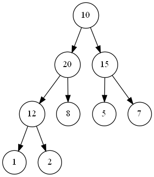
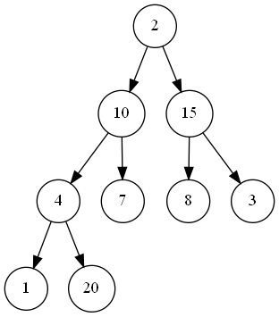
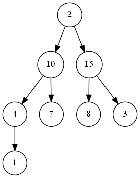
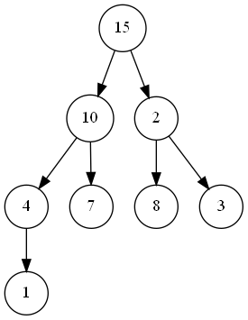
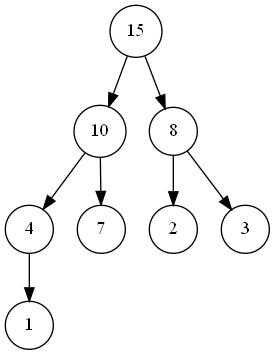
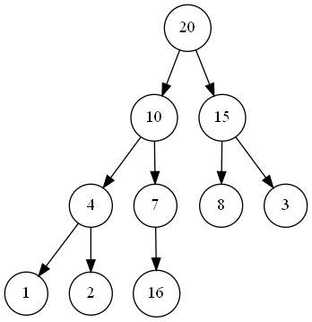
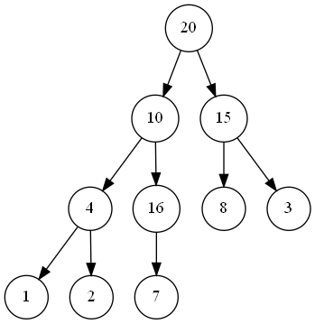

# LISTA 2 – Árvores 
## Prof. Igor Machado Coelho 
### Aluno: Ewerton Luiz Costadelle

Obs.: Os algoritmos de resposta desta lista encontram-se no repositório [__GitHub__](https://github.com/ecostadelle/arvores). A visualização das árvores, produzidas em [__GraphViz__](https://www.graphviz.org/), não são renderizadas pelo interpretador de MarkDown do GitHub. Por essa razão, foram convertidas para PNG e o [__resultado também esta disponível em PDF__](./Lista2.pdf).

---

### Exercício 1:

Considere uma árvore binária completa composta pelos seguintes elementos (representação sequencial): 10,20,15,12,8,5,7, 1 e 2. 

{width=30%}

a. Apresente o percurso de pré-ordem na árvore

> 10, 20, 12, 1, 2, 8, 15, 5, 7

b. Apresente o percurso em-ordem na árvore

> 1, 12, 2, 20, 8, 10, 5, 15, 7

c. Apresente o percurso de pós-ordem na árvore 
    
> 1, 2, 12, 8, 20, 5, 7, 15, 10

---

### Exercício 2:

Considere uma estrutura MAX-heap representada pelo seguinte vetor de níveis: 20, 10, 15, 4, 7, 8, 3, 1, 2 

a. efetue a remoção do elemento de maior prioridade: desenhe a árvore e vetor passo-a-passo 


{width=30%}

> Condição inicial: 20, 10, 15, 4, 7, 8, 3, 1, 2

{width=30%}

> Primeiro passo, comuta os valores do elemento de maior prioridade(20) com o último elemento do vetor(2): 2, 10, 15, 4, 7, 8, 3, 1, 20

{width=30%}

> Segundo passo, remove o elemento de maior prioridade (20): 2, 10, 15, 4, 7, 8, 3, 1

{width=30%}

> Terceiro passo, comuta o elemento que está fora de ordem (2) com o filho de maior prioridade (15): 15, 10, 2, 4, 7, 8, 3, 1

{width=30%}

> Quarto passo, comuta novamente o elemento que está fora de ordem (2) com o filho de maior prioridade (8): 15, 10, 8, 4, 7, 2, 3, 1

---

   b. efetue a inserção do elemento 16 (sem considerar a remoção anterior): desenhe a árvore e vetor passo-a-passo 

{width=30%}

> Primeiro passo, a inserção é realizada no final do vetor: 20, 10, 15, 4, 7, 8, 3, 1, 2, 16

{width=30%}

> Segundo passo, o valor inserido (16) é comutado com seu pai (7), que tem prioridade menor: 20, 10, 15, 4, 16, 8, 3, 1, 2, 7

{width=30%}

> Terceiro passo, o valor inserido (16) é comutado novamente, porém, com seu novo pai (10), que tem prioridade menor: 20, 16, 15, 4, 10, 8, 3, 1, 2, 7

---

### Exercício 3:

Considere a seguinte estrutura para uma árvore binária: 

```cpp
class Arvore
{
public:
    No *raiz;
};

class No
{
public:
    No *esq;
    No *dir;
};
```

> Para resolver essa questão, acrescentei às classes ``No`` e ``Arvore`` métodos construtores e destrutores. Ainda na classe ``No`` acrescentei uma variável para armazenar um dado do tipo inteiro (``int valor``). De modo que as classe no arquivo de [__cabeçalho__](https://github.com/ecostadelle/arvores/blob/main/include/arvore.hpp) ficaram como demonstrado no bloco de código  abaixo:

```cpp
class No
{
public:
    No *esq;
    No *dir;
    int valor;
    No(int);
    ~No();
};

class Arvore
{
public:
    No *raiz;
    Arvore();
    ~Arvore();
};
```

> No arquivo de [__implementação__](https://github.com/ecostadelle/arvores/blob/main/include/arvore.cpp) foram definidos os métodos construtor ``No()``, que recebe um valor inteiro e inicializa a variável ``valor``, recebida como parâmetro e o destrutor ``~No()`` que elimina os dados. Também foram definidos os métodos construtor ``Arvore()``, que inicializa a variável ``raiz`` como ``nullptr`` e o destrutor ``~Arvore()`` que deleta, através de um método recursivo (``deletaArvore()``) todos os nós da árvore. Os métodos construtores e destrutores são mostrados no bloco de código abaixo:

```cpp
No::No(int v)
{
    this->valor = v;
    this->esq = NULL;
    this->dir = NULL;
}

No::~No()
{
    this->valor = 0;
    this->esq = NULL;
    this->dir = NULL;
}

Arvore::Arvore()
{
    this->raiz = NULL;
}

Arvore::~Arvore()
{
    deletaArvore(this->raiz);
}

void deletaArvore(No *no)
{
    if (no != NULL)
    {
        deletaArvore(no->esq);
        deletaArvore(no->dir);
        delete no;
    }
}

```

> Em seguida populei os dados com uma árvore de busca. Como as variáveis ``*esq`` e ``*dir`` estavam públicas, optei em opera-las diretamente. Os valores inseridos na árvore teste são os mostrados a seguir:


> A inserção foi feita como mostrado no bloco de código, abaixo:

```cpp
// cria a árvore
Arvore arvore;

// insere os nós na árvore
arvore.raiz = new No(8);
arvore.raiz->esq = new No(3);
arvore.raiz->dir = new No(10);
arvore.raiz->esq->esq = new No(1);
arvore.raiz->esq->dir = new No(6);
arvore.raiz->dir->dir = new No(14);
arvore.raiz->esq->dir->esq = new No(4);
arvore.raiz->esq->dir->dir = new No(7);
arvore.raiz->dir->dir->esq = new No(13);
```

---

a. Escreva um algoritmo para computar a soma das folhas 

> O algoritmo percorre todos os nós da árvore em busca daqueles que não possuem filhos. Quando os encontra, retorna o seu valor (somado com $0$). As chamadas são recursivas e, como retorno, cada nó pai devolve a soma de seus filhos. Considerando que o algoritmo percorre toda a árvore, é possível concluir que depende diretamente do número de nós ($n$), nesse sentido o tempo de execução do algoritmo é $O(n)$.

```cpp
int somaFolhas(No *no)
{
    // variável para armazenar o valor da soma no escopo
    int soma = 0;
    // chamada recursiva para acessar os nós filhos localizados à esquerda
    if (no->esq) soma += somaFolhas(no->esq);
    // chamada recursiva para acessar os nós filhos localizados à direita
    if (no->dir) soma += somaFolhas(no->dir);
    // se o nó atual não possuir filhos, soma o valor do nó atual
    if (!no->esq and !no->dir) soma += no->valor;
    // retorna a soma
    return soma;
}
```

> *Saída*: ``Soma dos nos folha: 25``

---

b. Escreva um algoritmo para efetuar um percurso de pós-ordem

> O algoritmo faz uma chamada recursiva em busca dos filhos à esquerda, em seguida dos filhos à direita e, só após realizar as duas chamadas, imprime o valor do nó atual. Considerando que o algoritmo percorre toda a árvore, é possível concluir que depende diretamente do número de nós ($n$), nesse sentido o tempo de execução do algoritmo é $O(n)$.

```cpp
void posOrdem(No *no)
{
    // caso o nó atual não seja nulo, isto é útil porque nós folhas armazenam 
    // nullptr no lugar de filhos
    if (no != NULL)
    {
        // chamada recursiva para acessar os nós filhos localizados à esquerda
        posOrdem(no->esq);
        // chamada recursiva para acessar os nós filhos localizados à direita
        posOrdem(no->dir);
        // imprime o valor do nó atual
        std::cout << no->valor << " ";
    }
}
```

> *Saída*: ``Percorrendo pos ordem: 1 4 7 6 3 13 14 10 8``

---

c. Escreva um algoritmo para efetuar um percurso de em-ordem

> O algoritmo faz uma chamada recursiva em busca dos filhos à esquerda, em seguida imprime o valor do nó atual e, só após realizar a chamada, chamada recursiva para acessar os nós filhos localizados à direita. Considerando que o algoritmo percorre toda a árvore, é possível concluir que depende diretamente do número de nós ($n$), nesse sentido o tempo de execução do algoritmo é $O(n)$.

```cpp	
void emOrdem(No *no)
{
    // caso o nó atual não seja nulo, isto é útil porque nós folhas armazenam 
    // nullptr no lugar de filhos
    if (no != NULL)
    {
        // chamada recursiva para acessar os nós filhos localizados à esquerda
        emOrdem(no->esq);
        // imprime o valor do nó atual
        std::cout << no->valor << " ";
        // chamada recursiva para acessar os nós filhos localizados à direita
        emOrdem(no->dir);
    }
}
```

> *Saída*: ``Percorrendo em ordem: 1 3 6 4 7 8 10 13 14``

---

d. Escreva um algoritmo para efetuar um percurso de pré-ordem

> O algoritmo imprime o valor do nó atual e, em seguida, chama recursivamente para acessar os nós filhos localizados à esquerda e à direita. Considerando que o algoritmo percorre toda a árvore, é possível concluir que depende diretamente do número de nós ($n$), nesse sentido o tempo de execução do algoritmo é $O(n)$.

```cpp
void preOrdem(No *no)
{
    // caso o nó atual não seja nulo, isto é útil porque nós folhas armazenam 
    // nullptr no lugar de filhos
    if (no != NULL)
    {
        // imprime o valor do nó atual
        std::cout << no->valor << " ";
        // chamada recursiva para acessar os nós filhos localizados à esquerda
        preOrdem(no->esq);
        // chamada recursiva para acessar os nós filhos localizados à direita
        preOrdem(no->dir);
    }
}
```

> *Saída*: ``Percorrendo pre ordem: 1 3 6 4 7 8 10 13 14``

---

e. Escreva um algoritmo para computar a altura de um dado nó 

> O algoritmo percorre recursivamente todos os nós da árvore, quando encontra referência nula para dois nós significa que encontrou uma folha. O retorno da recursão para um nó nulo é altura zero, de modo que a folha retorna altura 1. O algoritmo ainda compara as alturas à esquerda e à direita, e retorna a maior delas acrescidas de 1, que é a altura do nó atual. Considerando que o algoritmo percorre toda a árvore, é possível concluir que depende diretamente do número de nós ($n$), nesse sentido o tempo de execução do algoritmo é $O(n)$.

```cpp	
int computaAltura(No *no)
{
    // variável para armazenar a altura no escopo
    int altura = 0;

    // caso o nó atual não seja nulo, isto é útil porque nós folhas armazenam 
    // nullptr no lugar de filhos
    if (no)
    {
        // chamada recursiva para acessar os nós filhos localizados à esquerda
        int esq = computaAltura(no->esq);
        // chamada recursiva para acessar os nós filhos localizados à direita
        int dir = computaAltura(no->dir);
        // se a altura da subárvore à esquerda for maior que à direita, 
        // a altura da subárvore atual é a altura à esquerda + 1
        if (esq > dir) altura = esq + 1;
        // se a altura da subárvore à direita for maior que à esquerda, 
        // a altura da subárvore atual é a altura à direita + 1
        else if (dir > esq) altura = dir + 1;
        // se as alturas da subárvore forem iguais, a altura da subárvore 
        // atual é a altura de uma delas + 1
        else altura = esq + 1;
    }
    // retorna a altura
    return altura;
}
```

> *Saída*: ``Altura da arvore: 4``

---

f. Escreva um algoritmo para computar o fator de balanceamento de um dado nó 

> Por definição, o fator de balanceamento, de um dado nó, é igual a diferença entre a altura dos filhos à esquerda e a altura dos filhos à direita. De modo que o algoritmo do exercício anterior permite calcular o fator de balanceamento de forma bem simples. 

```cpp
int computaFatorBalanceamento(No *no)
{
    // retorna a altura da subárvore à esquerda - a altura da subárvore à direita
    return computaAltura(no->esq) - computaAltura(no->dir);
}
```

> *Saída*: ``Fator de balanceamento da arvore: 0``

---

g. Escreva um algoritmo para percorrer a árvore em níveis

> Uma fila pode auxiliar na impressão em níveis, porque o primeiro elemento que entra é o primeiro elemento que sai. Nesse sentido, ao iniciar o algoritmo, o nó raiz é inserido na fila. Em seguida seus filhos são inseridos na fila. O passo seguinte é imprimir o valor da raiz e removê-la da fila. O processo é iterado enquanto houverem elementos na fila, adiciona-se os filhos do elemento que está na frente da fila e, em seguida, remove-se o pai. O algoritmo que percorre toda a árvore, imprimindo os valores de cada nó, pode ser visualizado no seguinte código:

```cpp
void percorreNiveis(No *no)
{
    // fila para armazenar os nós da árvore na ordem em que eles devem ser exibidos
    std::queue<No *> fila;
    // insere o nó raiz na fila
    fila.push(no);
    // enquanto a fila não estiver vazia
    while (!fila.empty())
    {
        // insere os filhos na fila
        if (fila.front()->esq) fila.push(fila.front()->esq);
        if (fila.front()->dir) fila.push(fila.front()->dir);
        // imprime o valor do nó atual
        std::cout << fila.front()->valor << " ";
        // remove o nó atual da fila
        fila.pop();
    }
}
```

> *Saída*: ``Percorrendo por niveis: 8 3 10 1 6 14 4 7 13``

> Considerando que o algoritmo percorre toda a árvore, é possível concluir que depende diretamente do número de nós ($n$), nesse sentido o tempo de execução do algoritmo é $O(n)$.

---

h. Escreva um algoritmo para computar o produto dos nós

> O algoritmo percorre recursivamente todos os nós da árvore, quando encontra uma folha, retorna o valor do nó, o pai desta folha outro filho, multiplica com o próprio valor e devolve ao seu pai. O nó raiz que é quem devolve o produto final, desse modo o algoritmo percorre a árvore em pós-ordem. Como pode ser verificado no bloco código, abaixo:

```cpp
int computaProduto(No *no)
{
    // variável para armazenar o produto no escopo
    int produto = 1;
    // chamada recursiva para acessar os nós filhos localizados à esquerda
    if (no->esq) produto *= computaProduto(no->esq);
    // chamada recursiva para acessar os nós filhos localizados à direita
    if (no->dir) produto *= computaProduto(no->dir);
    // após o retorno da recursão, retorna o produto
    if (no) produto *= no->valor;
    // retorna o produto
    return produto;
}
```

> *Saída*: ``Produto dos nos da arvore: 7338240``

> Considerando que o algoritmo percorre toda a árvore, é possível concluir que depende diretamente do número de nós ($n$), nesse sentido o tempo de execução do algoritmo é $O(n)$.

---
lang: "pt-br"
listings-no-page-break: true
---